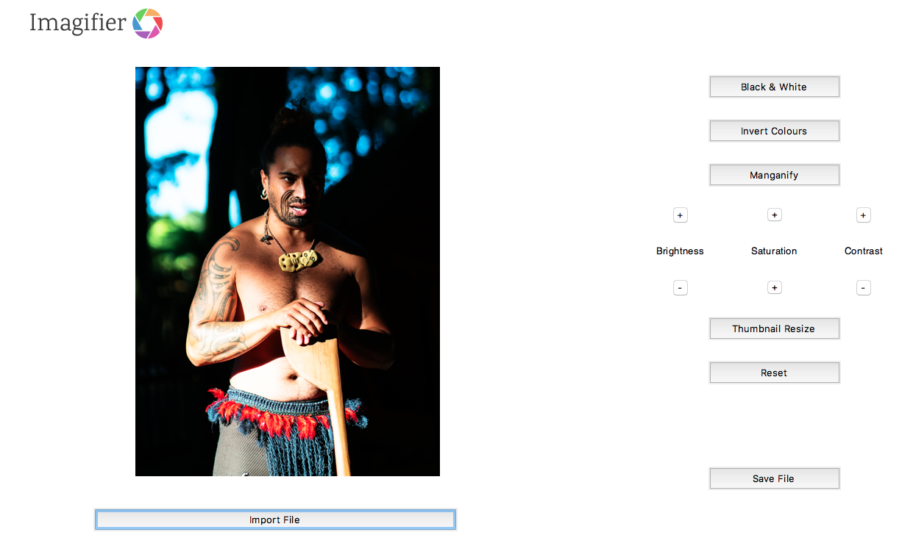

## Versatile, yet simple photo editor written in Python

Imagifier is a desktop image enhancement tool, functionalities include:

* Import/ Export File
* Black & White Conversaion
* Invert Color Conversion
* Maganify Filter
* Fundamental Adjustments: Brightness, Saturation and Contrast
* Thumbnail Resize
* Reset Image

### Built With

* [Python3](https://www.python.org/) Python is an interpreted, high-level, general-purpose programming language.
* [Pillow](https://pillow.readthedocs.io/en/stable/) Pillow is the friendly PIL fork by Alex Clark and Contributors. PIL is the Python Imaging Library that adds support for opening, manipulating, and saving many different image file formats.
* [TKinter](https://docs.python.org/3/library/tkinter.html) (“Tk interface”) is the standard Python interface to the Tk GUI toolkit.

### Screenshot

